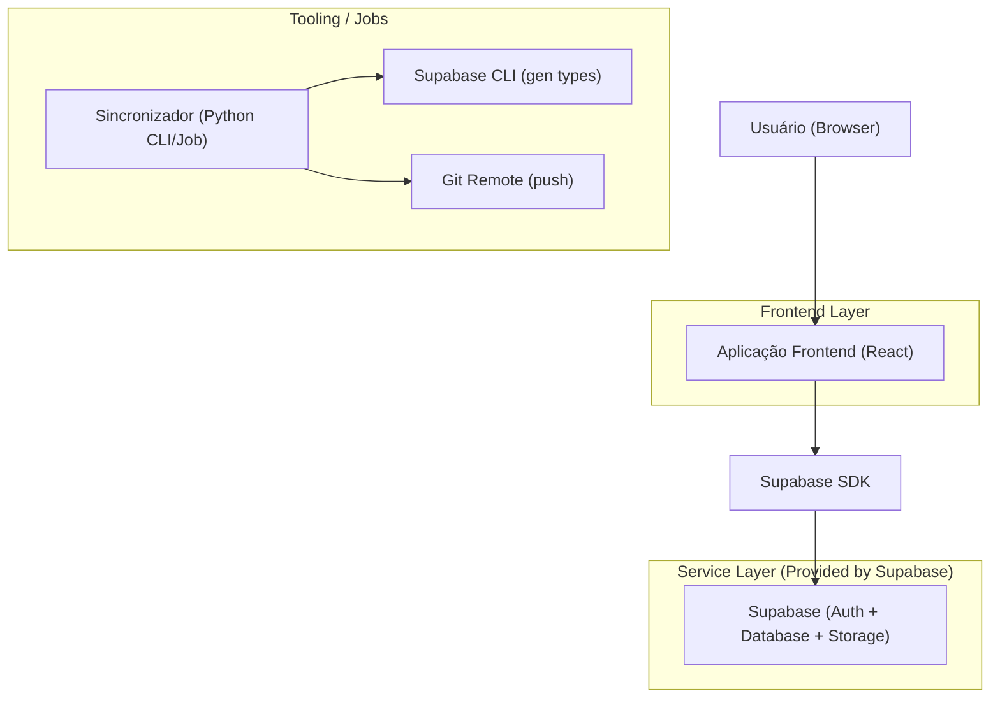

## 1.Architecture design

## 2.Technology Description
- Frontend: React@18 + vite + tailwindcss@3
- Backend: Supabase (Auth + PostgreSQL + Storage)
- Tooling (sincronização): Python@3 (subprocess + timeouts) + Supabase CLI + Git

## 3.Route definitions
| Route | Purpose |
|-------|---------|
| /login | Autenticação do usuário via Supabase |
| / | Dashboard com logomarca destacada e visão geral |
| /sync | Execução/monitoramento do sincronizador e configurações de ambiente |

## 4.API definitions (If it includes backend services)
Não há API backend dedicada: o frontend integra diretamente com Supabase via SDK.

## 6.Data model(if applicable)
O modelo de dados permanece no Supabase conforme o domínio do produto.
A recomendação para “alinhamento frontend/backend” é manter o frontend tipado a partir de `supabase gen types typescript` e tratar mudanças de schema como parte do fluxo do sincronizador (gerar tipos + commit/push).

Permissões recomendadas (RLS/roles):
- Conceder leitura básica ao anon quando aplicável: `GRANT SELECT ON [tabela] TO anon;`
- Conceder acesso completo ao usuário autenticado quando aplicável: `GRANT ALL PRIVILEGES ON [tabela] TO authenticated;`
