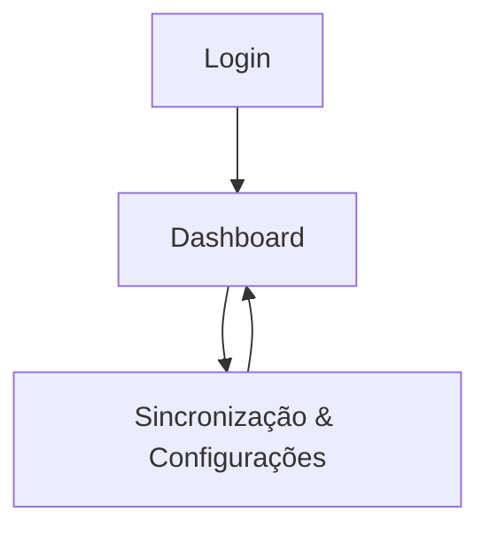

## 1. Product Overview
Aplicação web para operar o LocaCare Conecta com UI mais legível e marca mais evidente.
Padroniza frontend/backend com Supabase e fortalece o sincronizador para evitar travamentos e execuções inconsistentes.

## 2. Core Features

### 2.1 User Roles
| Papel | Método de cadastro | Permissões principais |
|------|---------------------|-----------------------|
| Operador | Login via Supabase (email/senha) | Acessa dashboard e dispara sincronizações conforme política do projeto |
| Admin | Login via Supabase (email/senha) + flag/perfil | Configura parâmetros do Supabase/projeto e gerencia políticas do sincronizador |

### 2.2 Feature Module
Nossos requisitos consistem nas seguintes páginas principais:
1. **Login**: autenticação via Supabase, estado de sessão, recuperação de senha.
2. **Dashboard**: header com logomarca destacada, tipografia consistente, visão geral de status e atalhos principais.
3. **Sincronização & Configurações**: parâmetros de integração Supabase (ambientes), execução/monitoramento do sincronizador, política anti-travamento e relatório.

### 2.3 Page Details
| Page Name | Module Name | Feature description |
|-----------|-------------|---------------------|
| Login | Autenticação | Autenticar via Supabase; manter sessão; recuperar senha; exibir erros de credenciais. |
| Dashboard | Branding & Tipografia | Exibir logomarca em área de destaque; aplicar escala tipográfica (H1/H2/body) e pesos; garantir contraste e legibilidade. |
| Dashboard | Navegação | Navegar para Sincronização & Configurações; exibir usuário logado e ação de sair. |
| Dashboard | Visão Geral | Exibir resumo do ambiente (dev/stg/prod) e indicadores essenciais do produto conforme dados disponíveis; destacar estados de atenção/erro. |
| Sincronização & Configurações | Integração Supabase | Selecionar/validar ambiente; validar variáveis obrigatórias; orientar correções sem expor segredos. |
| Sincronização & Configurações | Execução do Sincronizador | Iniciar sincronização; impedir dupla execução (lock); aplicar timeouts; registrar resultado (sucesso/falha) e mensagem acionável. |
| Sincronização & Configurações | Resiliência a Travamentos | Repetir tentativas com backoff; retomar a partir de checkpoint; detectar “travado” por falta de heartbeat; permitir “cancelar e limpar lock” com auditoria. |
| Sincronização & Configurações | Relatório | Exibir log resumido por etapa (health check, supabase types, git add/commit/push); exportar texto para suporte/debug. |

## 3. Core Process
**Fluxo do Operador**: você faz login → acessa o Dashboard para checar status → vai em Sincronização para executar → acompanha resultado e, se falhar, segue instruções de correção.

**Fluxo do Admin**: você faz login → valida/ajusta ambiente Supabase e políticas do sincronizador → executa sincronização quando necessário → revisa relatórios e remove locks apenas em caso de travamento.

